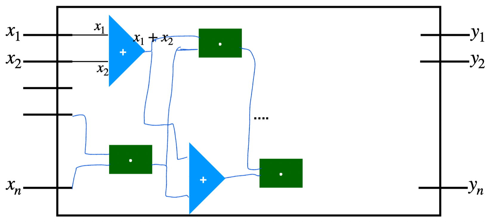

用$f$表示在域$\mathbb{F}$上的算术电路

门：

- addition $g(a,b)=a+b$
- multiplication $g(a,b)=a*b$

理解为参与者$P_1$的输入为$x$，输出为$y$，中间部分为电路，由各个不同的加法门电路、乘法门电路组成。

输入值使用次数为$t$的随机多项式掩盖。

> Shamir's secret sharing scheme
>
> 分享秘密$s$，采用 $(t,n)$ 门限方案
>
> - 选择一个次数为$t$的多项式，常数项为$s$,$p(x)=s+p_1x+...+p_tx^t$
> - 参与方$P_i$收到$(\alpha_i,p(\alpha_i))$

BGW协议分为三部分

- 输入分享阶段

  - 以$P_1$方为例，持有各自的隐私输入$x_1$
    - 选择一个次数为$t$的随机多项式$f(x)$，满足$f(0)=x_1$
    - 每一方$P_j$收到的份额为$f(\alpha_j)$ （$\alpha_j$为分配的，可以公开）
    - 最后每一方持有份额为$f(\alpha_i),...f(\alpha_i)$ （此即为秘密$x_1$的秘密份额）

- 电路实现

  - 加法门

    - 输入$f(x)$,$g(x)$；输出$h(x)$

    - 计算方式：各方在本地**无需交互**即可计算$f(\alpha_i)+g(\alpha_i)$（对于两个输入，计算方$P_i$可在本地计算出收到的份额之和）

      > 误区：一个门电路有两个输入，一个完整的电路是有多个门电路的，需要对每一个门电路的输出值进行秘密共享，并不是指只有两方参与两方的值输入。<u>BGW适用于三方及以上的场景</u>

  - 乘法门
  
- 输入$f(x),g(x)$；输出$h(x)=h_0+h_1x+...+h_{2t}x^{2t}$  ==（显然无法使用(t,n)进行秘密重构）==

- 每一方计算$c_i=h(\alpha_i)=f(\alpha_i)*g(\alpha_i)$，即每一方的份额为$c_i$

- ==存在的问题==

  - ==$h$不是随机的了     $\rightarrow$随机化系数，同时保持常数项不变==
  - ==多项式的次数增加     $\rightarrow$降次==

  解决上述两个问题，有两个阶段，先对$h(x)$进行随机化处理，再对$h(x)$进行降价。

  - **随机化处理**

    - 让每个参与方生成一个次数为$2t$，常数项为0的随机多项式$q_j(x)$，并公开，从而每一方可以计算$\tilde{h}(x)=h(x)+\sum_{j=1}^{n}q_j(x)$（由于$q_j(x)$没有常数项，所以$\tilde{h}(x)$的常数项为$ab$，并且其他项的系数都被随机化了)

      > 此时常数项就是$ab$，那么对$\tilde{h}(x)$进行分享，每一方持有一个份额$\tilde{h}(\alpha_i)$，那么$t$个参与方就可以重构出$\tilde{h}(x)$，得到$ab$。

  - **降价处理**

    - 定义$h(x)=h_0+h_1x+...+h_{2t}x^{2t}$的截断函数为$k(x)=h_0+h_1x+...+h_{t}x^{t}$，并且有$r_i=k(\alpha_i)$

    - 每一方计算$s_i=c_i+\sum_{j=1}^{n}q_j(\alpha_i)$

      > $\tilde{h}(x) \rightarrow \tilde{h}(\alpha_i) \rightarrow s_i$
      >
      > $h(x) \rightarrow f(x)g(x) \rightarrow f(\alpha_i)g(\alpha_i) \rightarrow c_i$
      >
      > $\sum_{j=1}^nq(x) \rightarrow \sum_{j=1}^n q(\alpha_i)$

    - 根据matrix multiplication，计算各自的秘密分享值$r_i=s_iA$，$r_i$就是$ab$的秘密分享值，任意选择$t$个$r_i$就可以重构出多项式$k(x)$，即可计算出$k(0)=ab$

      ==（即截断的过程$\tilde{h}(x) \rightarrow h(x)$是通过$A$连接的。）==

      > ==Claim:== 令$S=(s_1,...,s_n)$，$R=(r_1,...,r_n)$，那么一定存在一个$n*n$的常数矩阵A，满足$R=SA$。
      >
      > 证明（同时也是乘法运算的正确性证明）：
      >
      > 1. 令$H$是一个$1*n$的向量：$H=(h_0,...,h_t,...,h_{2t},0,...,0)$;
      >
      >    $k$是一个$1*n$的向量：$K=(h_0,...,h_t,0,...,0)$;
      >
      >    $B=(b_{ij})$是一个$n*n$的范德蒙德矩阵，$b_{ij}=\alpha_j^i$  ，$B= \begin{bmatrix}
      >     1 & 1 & \dots & 1\\
      >     \alpha_1^1  & \alpha_2^1 & \dots  & \alpha_n^1\\
      >     \alpha_1^2 & \alpha_2^2 & \dots & \alpha_n^2\\
      >     \vdots  & \vdots & \dots & \vdots\\
      >    \alpha_1^{n-1} & \alpha_2^{n-1} & \dots & \alpha_n^{n-1}
      >    \end{bmatrix}$
      >
      >    $P$是一个线性映射：$P(x_1,...,x_n)=(x_1,...,x_t,0,...,0)$
      >
      >    (可理解为将$(x_1,...,x_n)$映射成$(x_1,...,x_t,0,...,0)$，矩阵形式为$x_{(t)}=x_{(n)}P$，$P= \begin{bmatrix}
      >     1 &  &  & & &\\
      >      & \ddots &   & & &\\
      >      &  & 1 & & &\\
      >      &  &  & 0 & &\\
      >      &  &  &  & \ddots & \\ & & & & & 0 
      >    \end{bmatrix}$)
      >
      > 2. 从而有$HB=S$，
      >
      >    $HP=K$，
      >
      >    $KB=R$，
      >
      >    可得到$R=S(B^{-1}PB)$，令$A=B^{-1}PB$，有$R=SA$
      >
      > ==Lemma：linear functional==：对于任意的$t \le {n-1}$，和任意的线性函数$F(x_0,...,x_{n-1})=a_0x_0+...+a_{n-1}x_{n-1}$，（$x_i$为$P_i$方的输入变量$x_i$）可以被$t$隐私的计算。
      >
      > （即，t个$F(x_0,...,x_{n-1})$秘密值就可以恢复出真实的$F(x_0,...,x_{n-1})$
      >
      > ==Corollary：matrix multiplication==: $A$是一个$n*n$的矩阵，每一个参与方$P_i$有输入变量$x_i$，令$X=(x_0,...,x_{n-1})$,$Y=(y_1,...,y_n)$，有$Y=XA$，对于任意的$t \le {n-1}$，可以隐私地计算向量$Y$，使得$P_i$得到 $y_i$。
      >
      > （即，$[Y_0],[Y_1],...,[Y_{n-1}]=[X_0],...,[X_{n-1}]A$），每个用户将计算好的秘密分享值$[Y_i]_j$发送给对应的$P_j$，得到$n$个$[Y_i]_j$后可以计算出自己的$y_i$。

- 输出重构

 

    
